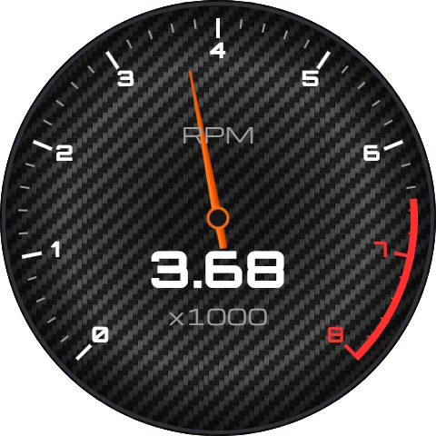
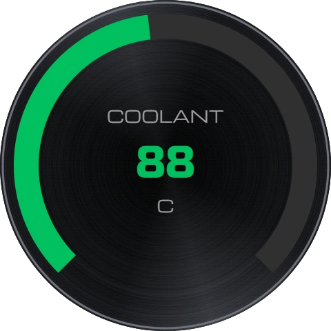
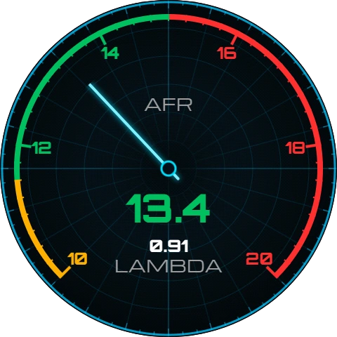
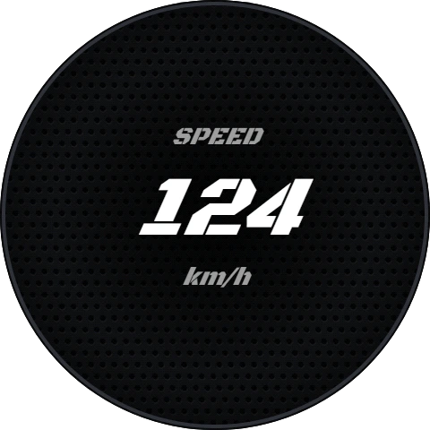
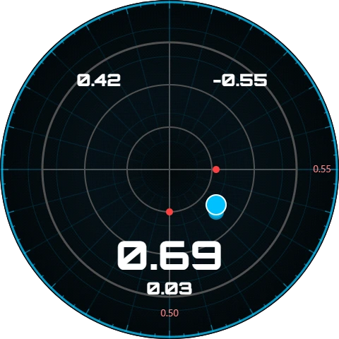

# roundGauge — CAN dashboard on ESP32-S3

[Русский](README.md) | **English**

[](https://www.espressif.com/en/products/socs/esp32-s3)
[](https://github.com/espressif/esp-idf)
[](https://lvgl.io)
[](LICENSE)

Firmware for a car dashboard on the round touch screen
[Waveshare ESP32-S3-Touch-LCD-2.1](https://www.waveshare.com/wiki/ESP32-S3-Touch-LCD-2.1)
(480×480): data comes from the CAN bus, what to show and how is configured
from a web page over Wi-Fi, and it is operated with two buttons on the board's
connector and swipes on the screen.

> 🧪 **Status: working prototype.** Screens, the editor, image upload, the access point,
> the g-meter, backgrounds, needles and fonts have been tested on the board. **CAN
> reception from a real bus, over-the-air update (`/ota`), the "Access" page and some
> widgets have not been tested on hardware** — the list is in
> [docs/fw-design.md §11](docs/fw-design.md) (in Russian).

## ✨ Features

| | What | Status |
|---|---|---|
| 🖥️ | ST7701S 480×480 screen, LVGL 9, two frame buffers, no tearing | ✅ works |
| 🎨 | Up to 8 screens of four types — dial, ring fill, plain number, g-meter — and up to 4 extra widgets on each (number, text, image, conditional indicator, bar, mini arc); backgrounds and needles from images, configurable scale ticks, needle pivot | ✅ works (`bar`/`arc`/`indicator` — 🧪) |
| 🔤 | Base set in `fw/media`: 18 fonts (Orbitron, Michroma, Russo One and Jura with Cyrillic, Black Ops One Slant, Segment7), 4 backgrounds (carbon, HUD grid, brushed metal, perforation), 3 needles; the built-in layout has 5 screens, including AFR | ✅ works |
| 📐 | G-meter: QMI8658 accelerometer, g-forces as a dot on a round grid with a trail and maxima (as in racing cars); gravity calibration at any board tilt, signals `g_lon`/`g_lat`/`g_vert`/`g_tot` are available to any widget | ✅ works on the board (axis and calibration accuracy — 🧪) |
| 👆 | Swipe left/right to switch screens; a build option for a screen without touch (`RG_HAS_TOUCH=0`) | ✅ works |
| 🔘 | Button 1: short press — next screen, hold — access point; button 2 — brightness cycle (100 / 60 / 30 / 10 %) | ✅ works |
| 🚌 | CAN (TWAI) reception, a ready-made rusEFI mapping preset out of the box, DBC-style signal-to-frame mapping, data timeouts, web sniffer, "demo" mode with a generator | 🧪 written, not tested on a bus |
| 📶 | Wi-Fi access point on a long press of button 1; the screen shows a card with the network name, password and address, then an icon with the client count; the name and password are set in the web interface | ✅ access point, 🧪 card |
| 🌐 | Web interface: home (status, brightness), screen editor with preview and drag & drop, media, CAN, sensor, "Access" (settings password, Wi-Fi name and password), update; RU/EN, light/dark theme | ✅ editor, media, sensor; 🧪 home and "Access" |
| 🔄 | Firmware and web interface updates via `/ota`, rollback of a failed update | 🧪 written, not tested on the board |

## 🖼️ What it looks like

<p align="center">
    
</p>

The five screens of the built-in layout: RPM (carbon), COOLANT (brushed metal), AFR (HUD grid),
SPEED (perforation), g-meter (HUD grid). These are not photos of the board but a render of the
layout by the same code that draws the editor preview, with the real backgrounds, needles and fonts
of the base set (values: 3680 rpm, 88 °C, AFR 13.4, 124 km/h).

## 🔧 Hardware

- **Board** Waveshare ESP32-S3-Touch-LCD-2.1: ESP32-S3R8, 16 MB flash, 8 MB PSRAM.
  Schematic and datasheets are in [hw/](hw/README.md) (in Russian).
- **CAN transceiver**, 3.3 V (SN65HVD230 or TJA1051T/3) — the board has none.
- **Power** in the car — a 12→5 V DC-DC converter with surge protection.

Everything connects to the J9 "12PIN Multi-function Interface" connector:

| J9 pin | Signal | Purpose |
|---|---|---|
| 2 | 5V | power from the DC-DC |
| 1, 5, 11 | GND | |
| 6 | 3V3 | transceiver supply |
| 3 | GPIO19 | CAN RX |
| 4 | GPIO20 | CAN TX |
| 12 | GPIO0 | button 1 (in parallel with BOOT) |
| 10 | GPIO44 | button 2 |

> ⚠️ In the car, power the board through J9 pin 2, not through the Type-C
> port: while Type-C is powered, a switch on the board hands GPIO44 to the
> USB-UART chip and button 2 stops working. On the desk, with Type-C power,
> button 1 remains. Details: [docs/fw-design.md §3](docs/fw-design.md).

## 📁 Layout

```
├── fw/                 firmware (ESP-IDF project)
│   ├── main/           initialization and task startup
│   ├── tasks/          one component per task: can, ui, buttons, touch, imu, webcfg
│   ├── common/         board (pins, screen, touch), config (settings, password,
│   │                   screen layout, CAN table), signals (signal values)
│   ├── www/            web interface → www partition
│   └── media/          base set of images → media partition
├── docs/fw-design.md   firmware design, decisions, open questions
├── hw/                 board schematic, datasheets, mechanical drawings
└── tools/
    ├── build/          release build and the portable flashing kit
    └── webtest/        mock server for the web interface
```

## 📋 Requirements

- [ESP-IDF v6.0](https://docs.espressif.com/projects/esp-idf/en/v6.0/esp32s3/get-started/)
- Waveshare ESP32-S3-Touch-LCD-2.1 board, USB Type-C cable

Dependencies (LVGL, screen and touch drivers) are downloaded by the component
manager on the first build.

## 🚀 Quick start

The ESP-IDF project is in `fw/`, not in the repository root. In VS Code with the
Espressif extension open `roundGauge.code-workspace` (or the `fw` folder),
otherwise the Build button looks for `CMakeLists.txt` in the root.

```bash
cd fw
idf.py build
idf.py -p COM5 flash monitor
```

Use the port of the CH343 USB-UART on the board's Type-C; download mode is
entered automatically. The target (`esp32s3`), 16 MB flash, PSRAM and the
partition table are already set in `fw/sdkconfig.defaults`. Delete
`fw/sdkconfig` after editing `sdkconfig.defaults`, or the new values are not
picked up.

> 💡 **Windows:** if ESP-IDF was installed with EIM and the system Python is
> newer than 3.11, `export.ps1` won't find its environment. Put the Python
> bundled with IDF first in `PATH` before running it:
> ```powershell
> $env:PATH = "$env:USERPROFILE\.espressif\tools\idf-python\3.11.2;$env:PATH"; . $env:USERPROFILE\esp\v6.0\esp-idf\export.ps1
> ```

### First run

After flashing, the screen shows five built-in screens: RPM (dial, carbon), COOLANT
(ring, brushed metal), AFR (mixture, a dial on the HUD grid with a neon needle),
SPEED (number, perforation) and the g-meter (HUD grid). Without a bus the values show `--`. To see
them alive without a bus:

1. **Hold button 1 for two seconds** — a card with the network name
   (`roundGauge-XXXX`), the password (`roundgauge`) and the address appears.
2. Connect to that network from a phone or laptop and open `http://192.168.4.1/`.
3. **CAN** → turn on **"Demo"** → Apply. The values start moving.
4. **Screens** — the look: drag widgets on the preview; "Apply to gauge" sends
   the layout to the board immediately. **Sensor** — calibrating the accelerometer
   for the g-force screen.
5. **Media** — your own backgrounds, needles and fonts. **Access** — the settings password and the Wi-Fi name and password.

### Controls

| Action | Result |
|---|---|
| Button 1, short press | next screen |
| Button 1, hold 2 s | Wi-Fi access point |
| Button 1, hold 10 s | clear a forgotten settings password (a warning is shown 3 s before) |
| Button 2 | brightness cycle: 100 → 60 → 30 → 10 → 100 % (remembered) |
| Swipe left / right | next / previous screen |

### Build options

```bash
idf.py -D RG_HAS_TOUCH=0 build   # a screen without a touch panel
```

The value lives in the build cache; to get touch back run
`idf.py -D RG_HAS_TOUCH=1 reconfigure`. The FPS lines at the top of the screen are
turned off with the `RG_UI_SHOW_FPS` constant in `fw/common/config/conf.h`.
More in [docs/fw-design.md §10](docs/fw-design.md).

## 📦 Release build

```bash
tools/build/build.sh        # Linux/macOS
tools\build\build.bat       # Windows
```

The script activates ESP-IDF by itself if needed, writes the version
`0.<YY>.<MMDD>` to `fw/version.txt`, builds with WARN log level and puts a
complete kit into `releases/roundGauge_v<version>_<time>/`: the firmware, the
`www` and `media` images, bootloader, partition table, `ota_data_initial.bin`
and `flash_args`, plus a **portable kit for flashing on the desk**: `esptool.exe`
(downloaded once from GitHub into `tools/build/.cache`, the version is pinned in
`tools/build/package_release.py`), `flash_all.bat` and `update_firmware.bat` (and `.sh`
for Linux/macOS). Next to the folder there is a
`releases/roundGauge_v<version>_<time>.zip` with the same contents: unpack it on any
Windows PC, connect the board and run `flash_all.bat` — nothing to install
(over Type-C, with the 12 V supply unplugged; pass the port if needed: `flash_all.bat COM5`).

- `flash_all.bat` — full flash (bootloader, partition table, firmware, web, media) at
  460800. The `media` partition is replaced with the base set (images uploaded through
  the web disappear); the screen layout, the CAN table, the settings and the password
  live in NVS and are kept.
- `update_firmware.bat` — only the firmware and the web interface: images and fonts in
  `media` are kept.

By hand the same is done with:

```bash
python -m esptool --chip esp32s3 -b 460800 --before default-reset --after hard-reset write-flash "@flash_args"
```

## 🌐 Web interface without hardware

```bash
python tools/webtest/mock_server.py
```

Open `http://localhost:8088/`. The server serves `fw/www` as is and emulates
the board's API, including CAN with fake frames — see
[tools/webtest/README.md](tools/webtest/README.md) (in Russian).

## 🧩 Third-party code

| What | Where | License |
|---|---|---|
| ST7701 init sequence and timings by Waveshare from [ESP32_Display_Panel](https://github.com/esp-arduino-libs/ESP32_Display_Panel) | `fw/common/board/st7701_init.h` | Apache-2.0 |
| [Alpine.js](https://alpinejs.dev) 3.14.1 | `fw/www/alpine.min.js` | MIT |
| [Bootstrap](https://getbootstrap.com) 5.3.0 | `fw/www/bootstrap.min.css` | MIT |
| Segment7 (Cedders, 2014), as LVGL fonts at 40/72/120 px | `fw/media/seg7_*.fnt` | SIL OFL 1.1 |
| Background `bg_carbon.bin`: [Carbon Fiber](https://cc0-textures.com/t/st-carbon-fiber) texture (ShareTextures, M. Tolga Arslan), processed | `fw/media/bg_carbon.bin` | CC0 |
| Orbitron, Michroma, Russo One, Jura ([Google Fonts](https://fonts.google.com)), as LVGL fonts | `fw/media/orbitron_*.fnt`, `michroma_*.fnt`, `russo_*.fnt`, `jura_*.fnt` | SIL OFL 1.1 |
| Black Ops One (Black-Ops Project Authors), modified: outlines slanted 24°, as LVGL fonts | `fw/media/blackops_*.fnt` | SIL OFL 1.1 |
| [Font Awesome Free](https://fontawesome.com) 6.4.0 | `fw/www/fontawesome/` | icons CC BY 4.0, font SIL OFL 1.1, code MIT |

LVGL (MIT) and Espressif components (Apache-2.0) are downloaded at build time
and are not stored in the repository.

## 📄 License

[MIT](LICENSE)
